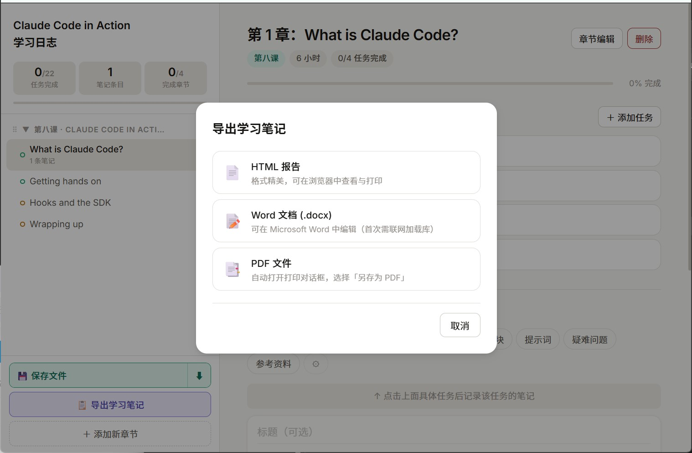

# 📓 Learning NoteBook

**中文** | [English](#english)

一款零依赖、开箱即用的单文件学习日志工具，专为系统性课程学习设计。  
打开浏览器，即可开始记录你的学习旅程——无需安装，无需注册，数据保存在文件本身。

---

## ✨ 功能特性

### 📋 学习计划管理
- **阶段 × 章节两级结构**：将课程拆分为多个阶段，每个阶段包含若干章节，层次清晰
- **任务打卡**：每个章节下可添加带日期的学习任务，勾选即标记完成
- **进度统计**：实时显示总任务完成数、笔记条数、完成章节数及整体进度条

### 📝 富文本笔记系统
- **8 种内置笔记分类**：主要收获、知识点、专业术语、心得体会、代码块、提示词、疑难问题、参考资料（可自定义增删）
- **混合内容编辑**：每条笔记支持自由组合——
  - 📝 文字段落
  - 🖼 图片（本地上传或截图直接粘贴 `Ctrl/Cmd+V`，Base64 内嵌存储）
  - ⊞ 可编辑表格（支持动态增删行列）
  - ⌨ 代码块（含语言标签与一键复制按钮）
- **星级评分**：1–5 星标记笔记重要程度
- **任务关联**：笔记可绑定至具体学习任务，双向追踪
- **全文搜索**：在当前章节内实时检索笔记内容

### 🗂 灵活的结构管理
- **拖拽排序**：阶段、章节、任务均可拖拽重新排列
- **跨阶段移动**：章节可随时移动至其他阶段
- **颜色标签**：每个章节支持 4 种颜色（绿 / 紫 / 橙 / 珊瑚）以作视觉区分
- **侧边栏宽度自由调节**：拖拽分隔线即可

### 💾 数据持久化
- **保存至文件本身**：点击「保存文件」或按 `Ctrl/Cmd+S`，全部数据以 JSON 快照写回 HTML 文件，无需服务器、无需数据库
- **另存为副本**：支持另存新文件，方便版本备份
- **导出笔记**：支持将笔记导出为 Markdown 或纯文本格式

### 🎨 界面体验
- **真正的单文件**：整个应用就是一个 `.html` 文件，CSS、JavaScript、数据全部内嵌，无外部运行时依赖
- **图片灯箱**：点击笔记中的图片可全屏查看
- **键盘快捷键**：`Ctrl/Cmd+S` 快速保存，`Esc` 关闭弹窗

---

## 🚀 快速开始

```bash
# 克隆仓库
git clone https://github.com/Zhao79/Learning-NoteBook.git

# 直接用浏览器打开即可，无需其他步骤
open Learning_NoteBook.html
```

> ✅ 兼容所有现代桌面浏览器（Chrome、Edge、Firefox、Safari）  
> ⚠️ **文件保存功能**依赖浏览器的 File System Access API，推荐使用 Chrome 或 Edge 以获得最佳体验；其他浏览器可正常使用，但保存时会触发下载而非原地覆写

---

## 📁 文件结构

```
Learning_NoteBook.html   # 完整应用（单文件，含全部 CSS / JS / 数据）
README.md
LICENSE
```

用户数据以 JSON 快照形式内嵌于 HTML 文件的 `__SNAPSHOT__` 变量中，每次保存时自动更新。

---

## 🔧 自定义与二次开发

文件结构清晰，可直接编辑：

| 区域 | 说明 |
|---|---|
| `DEFAULT_PHASES` / `DEFAULT_WEEKS` | 修改默认的阶段与章节模板 |
| `DEFAULT_CATS` | 修改默认笔记分类列表 |
| `:root { }` CSS 变量 | 调整整体配色方案 |
| `__SNAPSHOT__` | 运行时数据（每次保存后自动更新，不建议手动修改） |

---

## 📸 预览

> 

---

## 📄 许可证

本项目基于 [Apache License 2.0](LICENSE) 开源。

```
Copyright <20260401> <ZhaoLiang>

Licensed under the Apache License, Version 2.0 (the "License");
you may not use this file except in compliance with the License.
You may obtain a copy of the License at

    http://www.apache.org/licenses/LICENSE-2.0
```

---
---

<a name="english"></a>

# 📓 Learning NoteBook

**[中文](#-learning-notebook)** | English

A zero-dependency, single-file learning journal app for structured course tracking.  
Open it in any browser and start logging your study journey — no installation, no sign-up, data saved inside the file itself.

---

## ✨ Features

### 📋 Study Plan Management
- **Two-level structure** — Phases and Chapters let you organize any course clearly
- **Task checklist** — Add date-stamped tasks to each chapter and check them off as you go
- **Live progress stats** — Sidebar shows completed tasks, note count, finished chapters, and an overall progress bar

### 📝 Rich Note Editor
- **8 built-in note categories** — Key Takeaways, Concepts, Terminology, Insights, Code Snippets, Prompts, Open Questions, References (fully customizable)
- **Mixed-content blocks** — Freely combine within each note:
  - 📝 Text paragraphs
  - 🖼 Images (upload locally or paste screenshots with `Ctrl/Cmd+V`; stored as Base64)
  - ⊞ Editable tables (add/remove rows and columns dynamically)
  - ⌨ Code blocks (with language label and one-click copy button)
- **Star ratings** — Mark note importance from 1 to 5 stars
- **Task linking** — Attach notes to specific tasks for two-way traceability
- **Full-text search** — Search notes within the active chapter in real time

### 🗂 Flexible Structure Management
- **Drag-and-drop reordering** — Phases, chapters, and tasks are all draggable
- **Cross-phase chapter moves** — Relocate any chapter to a different phase at any time
- **Color labels** — Assign one of 4 colors (Teal / Purple / Amber / Coral) to each chapter
- **Resizable sidebar** — Drag the divider to your preferred width

### 💾 Data Persistence
- **Save back to the file** — Click "Save File" or press `Ctrl/Cmd+S` to write all data as a JSON snapshot directly into the HTML file — no server or database needed
- **Save as new copy** — Duplicate the file as a backup
- **Export notes** — Export your notes as Markdown or plain text

### 🎨 UI & Experience
- **Truly single-file** — The entire app (CSS, JavaScript, and data) lives in one `.html` file with no external runtime dependencies
- **Image lightbox** — Click any image in a note to view it full screen
- **Keyboard shortcuts** — `Ctrl/Cmd+S` to save, `Esc` to close dialogs

---

## 🚀 Quick Start

```bash
# Clone the repository
git clone https://github.com/Zhao79/Learning-NoteBook.git

# Open directly in your browser — nothing else required
open Learning_NoteBook.html
```

> ✅ Works in all modern desktop browsers (Chrome, Edge, Firefox, Safari)  
> ⚠️ The **file-save feature** relies on the browser's File System Access API. Chrome or Edge is recommended for in-place saving; other browsers will trigger a download instead

---

## 📁 File Structure

```
Learning_NoteBook.html   # Complete app — CSS, JS, and data all embedded
README.md
LICENSE
```

All user data is stored as a JSON snapshot in the `__SNAPSHOT__` variable inside the HTML file, updated automatically on every save.

---

## 🔧 Customization

The file is designed to be readable and editable:

| Section | Description |
|---|---|
| `DEFAULT_PHASES` / `DEFAULT_WEEKS` | Edit the default phase and chapter templates |
| `DEFAULT_CATS` | Edit the default note category list |
| `:root { }` CSS variables | Adjust the color scheme |
| `__SNAPSHOT__` | Live runtime data (auto-updated on save; manual edits not recommended) |

---

## 📸 Preview

> *(Add screenshots here)*

---

## 📄 License

This project is licensed under the [Apache License 2.0](LICENSE).

```
Copyright <20260401> <ZhaoLiang>

Licensed under the Apache License, Version 2.0 (the "License");
you may not use this file except in compliance with the License.
You may obtain a copy of the License at

    http://www.apache.org/licenses/LICENSE-2.0
```

---

<p align="center">Made with ❤️ for structured learning</p>
